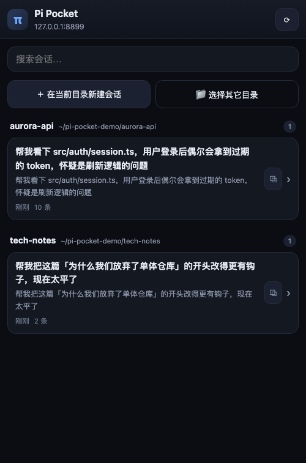
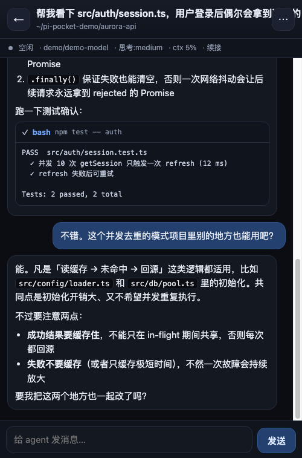
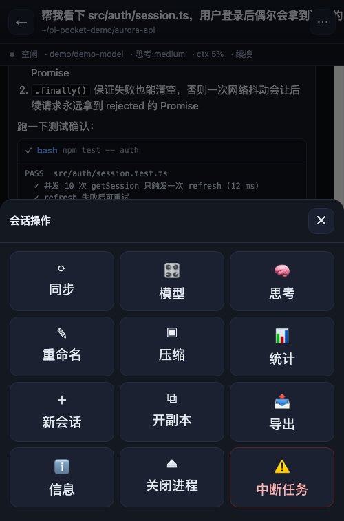

# Pi Pocket

手机连上同一局域网的电脑，浏览并进入电脑上**所有** Pi Agent 会话。

```
手机浏览器 / PWA  ──HTTP + WebSocket──▶  电脑上的 Pi Pocket (8787)
                                            └─每次进入会话 spawn 一个 pi --mode rpc 进程
```

## 为什么不是微信小程序

微信小程序**正式版不能**用局域网 IP + `http`/`ws` 明文通信：`request`/`connectSocket`
目标必须是已备案域名的 HTTPS/WSS，只有开发版/体验版在微信客户端里打开调试时才豁免。
也就是说"扫码连家里电脑"这条路在小程序里走不通。

所以这里用 **手机浏览器 + 添加到主屏幕（PWA）**：无需域名、无需备案、无需上架，
手机上体验和原生 App 基本一致（全屏、无地址栏、深色主题）。

想要真正的 App，`android/` 里还有一个 **34KB 原生 APK**（纯 Java + WebView，无 AndroidX/
Gradle 依赖），额外补上了浏览器给不了的能力：**局域网自动发现、系统返回键映射、记住地址、
断线重连**。源码共用同一套前端，改网页 = 改 App。

```bash
cd android && ./build.sh          # → dist/pi-pocket.apk
./build.sh --install              # 顺便装到已连接的手机
```

详见 [android/README.md](android/README.md)。

## 启动

```bash
cd ~/pi-pocket
npm install              # 已装好可跳过
node server.mjs --qr     # 打印二维码，手机扫码打开
node server.mjs --qr --open   # 顺便在电脑浏览器打开
./start.sh               # 等价于 node server.mjs --qr
```

终端会打印局域网地址和二维码（手机需与电脑同一 Wi-Fi）：

```
本机     http://127.0.0.1:8787
局域网   http://192.168.1.50:8787  (en0)
```

iPhone：Safari 打开 → 分享 → 添加到主屏幕。

## 功能

**会话列表（首页）**
- 扫描 `~/.pi/agent/sessions/`，按项目（工作目录）分组，展示所有会话
- 每条显示：标题/首条消息、最后修改时间、消息条数、自定义名称
- 搜索框过滤；⟳ 刷新；已被手机打开的会话显示「运行中/已打开」徽标
- ＋ 在当前目录新建会话；📁 指定任意目录新建
- 每条右侧 `⧉` 用**副本**方式打开（不碰原会话文件）

**对话页**
- 流式输出、思考过程折叠、工具调用卡片（点击展开输出，实时进度）
- 用户 / 助手 / 工具结果 / 压缩 / 重试 / 扩展错误 全部可见
- 状态条：运行中/空闲、模型、思考等级、上下文占用百分比、进入方式
- 发送消息；agent 正在生成时可以「插话（steer）」
- 停止（abort）当前任务
- URL 带 `?a=<key>`：刷新页面、复制链接都能回到同一个会话

**菜单（⋯）**
同步、切换模型、思考等级、重命名会话、压缩上下文、统计、新建会话、开副本、
导出 HTML、连接信息、关闭进程、中断任务。

**返回 / 退出逻辑**
- 顶部 ← 或系统手势返回 → 回到会话列表，**电脑上的 agent 继续在后台跑**（不被杀）
- 菜单「关闭进程」→ 结束这个 agent 进程，会话文件保留（历史不丢）
- 菜单「开副本」→ fork 成新文件后继续，原会话文件完全不受影响
- 列表里的运行中徽标让你随时知道电脑上还开着哪几个会话

## 三种进入方式

| 方式 | 命令 | 说明 |
| --- | --- | --- |
| 续接（默认） | `pi --mode rpc --session <file>` | 真正续上原会话，历史/上下文/分支都在 |
| 副本 | fork 成新文件再 `--session` | 完全不碰原文件，适合原会话还开在电脑终端里 |
| 新建 | `pi --mode rpc`（指定 cwd） | 全新会话 |

> `PI_POCKET_ISOLATE=1 node server.mjs` 可让「续接」也默认走副本模式。

## 环境变量 / 参数

| 变量 | 默认 | 说明 |
| --- | --- | --- |
| `PI_POCKET_PORT` / `--port=` | 8787 | 监听端口 |
| `PI_POCKET_HOST` / `--host=` | 0.0.0.0 | 监听地址 |
| `PI_POCKET_TOKEN` | 无 | 设置后 HTTP/WS 都要求 `x-pi-pocket-token` 或 `?token=` |
| `PI_POCKET_ISOLATE` | 0 | 置 1 则默认副本方式打开 |
| `PI_POCKET_CLI` | 包内 `dist/cli.js` | 指定 pi CLI 入口 |

`--qr` 打印二维码，`--open` 顺便在电脑浏览器打开。

## 安全

服务默认监听 `0.0.0.0` 且**不做鉴权**，局域网内任何人都能用它操作你的电脑（可读文件、
执行命令）。仅在可信网络里使用；公共 Wi-Fi 下请加令牌：

```bash
PI_POCKET_TOKEN=$(openssl rand -hex 12) node server.mjs --qr
```

加了令牌后扫码链接会自动带上 `?token=`。

## 已知限制

- **同一会话不要两边同时发消息**：续接模式下手机进程和电脑终端进程写同一个会话
  文件，可能互相覆盖。要并行操作请用「副本」，或设置 `PI_POCKET_ISOLATE=1`。
- 每次进入会话会启动一个 pi 进程（约 1–3 秒）。返回列表后进程保留，最多同时开
  4 个左右比较稳妥；用「关闭进程」释放。
- 手机切后台后 WebSocket 可能被系统断开，回到前台点菜单「同步」即可恢复。
- 手机端的「停止」按钮只在 agent 正在生成时出现（对应 RPC `abort`）。

## 自检

```bash
node server.mjs &                 # 先起服务
node tools/ui-check.mjs 8787      # 首页/进入/返回/深链/菜单（24 项断言）
node tools/ui-check.mjs 8787 legacy=1   # 同一套断言跑降级包
node tools/send-check.mjs 8787 0  # 真发一条消息，验证流式/工具卡片（会消耗 token）
./tools/android-netcheck.sh       # 安卓的局域网发现逻辑（JVM 直接跑，不需要设备）
```

Android 端到端自检见 [android/README.md](android/README.md)（模拟器里穿透 WebView 检查，17 项）。

用 headless Chrome + 裸 CDP 驱动，无需安装额外依赖，截图会写到 `/tmp/pocket-*.png`。

## 目录结构

```
server.mjs              HTTP + WS 服务，会话目录 API + 命令透传
src/session-catalog.mjs 扫描 ~/.pi/agent/sessions 并按项目分组
src/agent-manager.mjs   管理 pi RPC 子进程（启动/复用/关闭/事件缓冲）
public/                 前端（app.js 为源码，app.legacy.js 由 esbuild 生成）
android/                Android App（纯 Java + WebView 外壳）
tools/                  自检脚本
docs/                   截图
```

### 老手机（旧版 WebView）

旧版 Android WebView 不支持 `?.` / `??`，会直接 SyntaxError 白屏。`public/index.html`
会探测并自动降级到 `public/app.legacy.js`；该文件由 esbuild 生成，**源码只维护 app.js**：

```bash
npm run build:legacy    # 改完 public/app.js 后执行一次
```

手动验证降级路径：浏览器打开 `http://<电脑>:8787/?legacy=1`。

## 截图

截图用的是一套**合成的演示数据**（`npm run demo:data` 生成，放在 `~/pi-pocket-demo/`），
不包含任何真实项目名、内网 IP 或私人对话。

| 会话列表 | 对话页 | 菜单 |
| --- | --- | --- |
|  |  |  |

自己重拍：

```bash
npm run demo:data      # 生成合成会话数据
npm run demo:serve     # 用这份数据在 8899 起服务
npm run demo:shots     # headless Chrome 截图 → /tmp/demo-*.png
```
