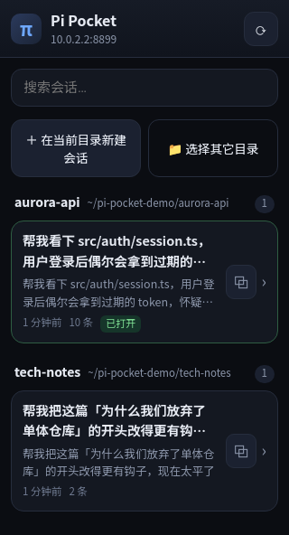
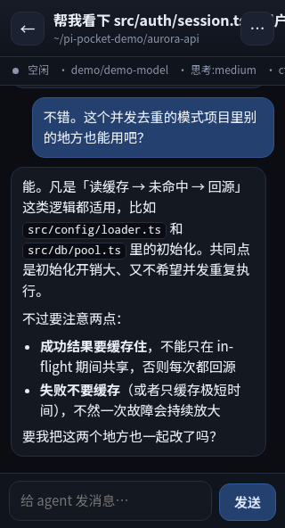

# Pi Pocket · Android

一个 36KB 的原生 APK：打开就能找到同一 Wi-Fi 下电脑上的 Pi Pocket，进去就是完整的
会话列表 / 对话界面。

<p align="center">
  
  
</p>

截图是在 Android 15 模拟器里真实跑出来的（App → WebView → 电脑上的 Pi Pocket）。

```
Pi Pocket.apk  ──HTTP/WS──▶  电脑 192.168.x.x:8787  ──RPC──▶  pi agent 进程
   (WebView 外壳 + 原生自动发现/返回键/断线重连)
```

## 为什么是 WebView 壳，而不是重写一套原生 UI

界面本身（会话列表、流式对话、工具卡片、菜单）已经在前端 `public/` 里写好了，
一套代码手机浏览器 / PWA / App 三处通用。原生层只补浏览器给不了的三件事：

| 原生能力 | 为什么需要 |
| --- | --- |
| **局域网自动发现** | 手机不知道电脑 IP，手输容易错。App 扫当前网段 8787 端口 + 探活 `/api/health` 自动列出 |
| **系统返回键** | 网页里 ← 只能点按钮；Android 返回手势必须映射成"退出会话→回列表→回桌面"三级 |
| **记住地址 + 断线重连** | 连过一次直接进主界面；连不上自动退回连接页而不是白屏 |

这样 App 只有 ~600 行 Java，且**前端改动会立刻反映到 App 里**（因为加载的就是电脑上那份网页）。

## 构建

不需要 Android Studio，也不需要 Gradle：直接用 SDK 自带的 `aapt2 + javac + d8 + apksigner`。

```bash
# 一次性准备 SDK（约 700MB，含 build-tools 与 platform）
brew install --cask android-commandlinetools        # 若 brew 拉不动见下方备注
export ANDROID_HOME=$HOME/android-sdk
$ANDROID_HOME/cmdline-tools/latest/bin/sdkmanager --install \
  "platforms;android-35" "build-tools;35.0.1"

# 构建
cd android
./build.sh                 # → dist/pi-pocket.apk
./build.sh --install       # 顺便 adb install -r 到已连接的手机
```

产物约 **36 KB**（无 AndroidX、无第三方依赖），签名用的 `android/debug.keystore`
（口令 `pipocket`）会自动生成，仅供自用；上架需换成自己的正式签名。

> brew 下载 commandlinetools 若报 `Connection reset`，直接用 curl 拉：
> ```bash
> curl -fL -o /tmp/cmdline-tools.zip \
>   https://dl.google.com/android/repository/commandlinetools-mac-11076708_latest.zip
> mkdir -p ~/android-sdk/cmdline-tools && unzip -q /tmp/cmdline-tools.zip -d /tmp/ct
> mv /tmp/ct/cmdline-tools ~/android-sdk/cmdline-tools/latest
> ```

## 安装到手机

**方式 A（推荐）**：数据线 + adb
```bash
./build.sh --install
```

**方式 B**：把 `dist/pi-pocket.apk` 传到手机（微信/AirDrop/网盘），点开安装。
首次需允许「安装未知来源应用」。

要求：**Android 7.0 (API 24) 及以上**。

### 老手机的兼容处理

桌面/新版 WebView 用的是现代 JS，但**旧版 WebView 不支持 `?.` / `??`**，会直接
`SyntaxError` 导致白屏。所以：

1. `public/index.html` 里用一段 ES5 探测代码判断是否支持现代语法；
2. 不支持就自动改加载 `public/app.legacy.js`；
3. 这个降级包由 esbuild 从 `app.js` 生成，**源码只维护一份**：

```bash
npm run build:legacy     # 改完 public/app.js 后执行一次
```

另外 `public/compat.js` 给旧 WebView 补了 `replaceChildren` / `append` / `remove`。

手动验证降级路径：浏览器打开 `http://<电脑>:8787/?legacy=1`。

## 使用

1. 电脑上先启动服务：`node server.mjs`（或 `./tools/run.sh`）
2. 手机连**同一个 Wi-Fi**，打开 Pi Pocket
3. 点「扫描局域网」→ 自动列出电脑地址 → 点一下连接（也可以手输 `IP:端口`）
4. 连上后就是完整界面；下次启动直接进入

电脑端设了 `PI_POCKET_TOKEN` 的话，在 Token 输入框里填上即可（会一起记住）。

### 返回键行为

| 位置 | 按返回 |
| --- | --- |
| 对话页 | 回会话列表（**电脑上的 agent 继续跑**） |
| 会话列表 | 回桌面（App 退到后台，agent 继续跑） |
| 连接页 | 退出 App |

彻底结束某个 agent 用对话页菜单里的「关闭进程」。

## 网络与安全

- App 已声明 `usesCleartextTraffic` + `network_security_config` 放行明文 http/ws：
  局域网的 Pi Pocket 没有证书，Android 9+ 默认会拦掉，必须显式允许。
- `NEARBY_WIFI_DEVICES`（带 `neverForLocation`）仅用于 Android 13+ 读取本机网段；
  服务端不读取、不上报任何位置信息。
- App 本身不联网到任何第三方，只访问你填的那个局域网地址。
- 服务端默认**无鉴权**，同一 Wi-Fi 下任何人都能连。公共网络下请用
  `PI_POCKET_TOKEN=xxx node server.mjs`。

## 已知限制

- 只支持 `http://` 目标（局域网明文）。若你给 Pi Pocket 套了 HTTPS 域名反代，
  WebView 也能打开，但自动发现的探活目前只探 http。
- 没有后台推送：App 切后台后 WebSocket 可能被系统断开，回到前台点菜单「同步」即可。
  想要"任务完成提醒"需要额外做前台服务（Foreground Service）+ 通知，目前没做。
- 扫描是 `/24` 网段逐个探端口（1..254，48 并发），实测约 **5 秒**；
  更大的网段只试网关和常见地址，避免扫太久。

## 代码结构

```
android/
├── build.sh                        一键构建脚本（aapt2/javac/d8/apksigner）
├── app/src/main/
│   ├── AndroidManifest.xml         权限、明文放行、主题
│   ├── java/com/pipocket/
│   │   ├── MainActivity.java       连接页：手输 / 扫描 / 最近记录
│   │   ├── WebActivity.java        主界面：WebView + 返回键 + 断线重连
│   │   └── Net.java                地址规整、/api/health 探活、网段扫描（纯 Java，可单测）
│   └── res/                        深色主题、图标、布局
└── dist/pi-pocket.apk              构建产物
```

## 自检

### 不依赖设备（JVM 直接跑局域网发现逻辑）

`Net.java` 只用 JDK 的 `java.net`，不含任何 Android API，所以能脱离 Android 跑：

```bash
./tools/android-netcheck.sh                 # 自动用本机 en0 地址做目标
./tools/android-netcheck.sh 192.168.1.50:8787
```

会验证：地址规整 8 种输入、网卡识别与排序、`/api/health` 探活、真实扫描能否扫到目标
（实测 254 个地址约 5 秒）。

### 端到端（模拟器或真机）

```bash
# 1. 电脑上起服务
node server.mjs

# 2. 起模拟器（或插上真机）
ANDROID_HOME=~/android-sdk ~/android-sdk/emulator/emulator -avd pipocket &

# 3. 装 App 并连上（模拟器里用 10.0.2.2 访问宿主机）
cd android && ./build.sh --install

# 4. 接上 WebView 调试通道，跑断言
P=$(adb shell pidof com.pipocket | tr -d '\r')
adb forward tcp:9222 localabstract:webview_devtools_remote_$P
node tools/android-app-check.mjs 9222
```

`tools/android-app-check.mjs` 会穿透到安卓 WebView 内部检查：进程活着、WebActivity 在前台、
页面标题、会话列表渲染、无横向溢出、点进会话后消息/工具卡片/状态条、返回键行为、
后台 agent 是否还在跑、有无 JS 异常（17 项）。
